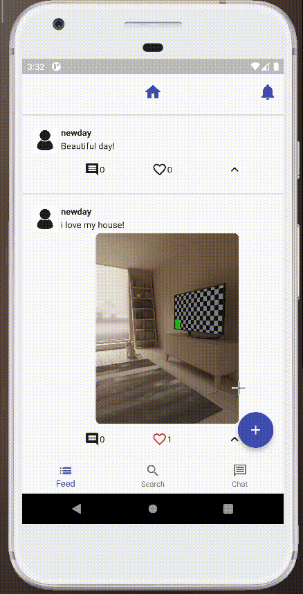
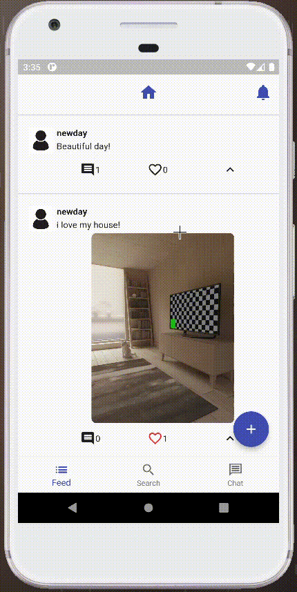
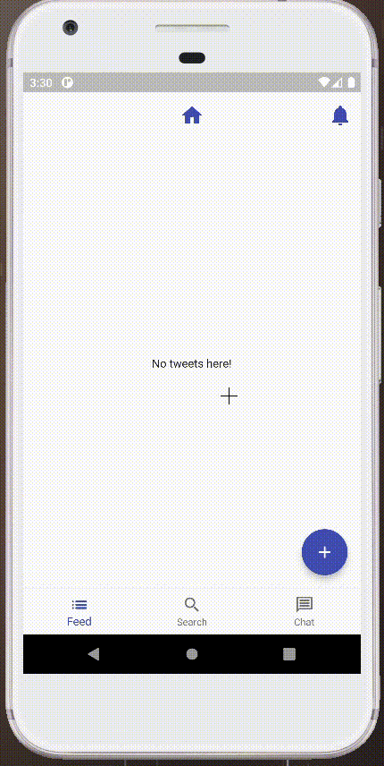

# TweetApp - Mạng xã hội dựa trên Twitter

Chào mừng bạn đến với kho lưu trữ TweetApp, một dự án di động cho mạng xã hội dựa trên Twitter, được phát triển bằng Dart với Flutter. Ứng dụng này cho phép người dùng chia sẻ suy nghĩ của họ trong các thông điệp ngắn gọi là Tweets, cũng như tương tác với người khác thông qua bình luận, lượt thích và theo dõi người dùng khác.

## Tính năng

TweetApp hiện tại bao gồm các tính năng sau:

1. **Đăng nhập và Đăng ký người dùng:** Người dùng có thể tạo tài khoản, đăng nhập và truy cập tài khoản hiện có của họ.
   
2. **Tạo Tweet:** Người dùng có thể soạn các Tweet để chia sẻ với người theo dõi của họ.
   
   

4. **Tạo bình luận:** Ngoài Tweet, người dùng có thể bình luận về bài viết của người dùng khác.
5. **Hệ thống ảnh và lượt thích:** Người dùng có thể đính kèm ảnh trong Tweet và bình luận, cũng như bày tỏ sự thích thú với bài viết của người khác.
   
6. **Hệ thống theo dõi:** Người dùng có thể theo dõi người dùng khác và xem nguồn cấp Tweet từ những người họ theo dõi.
7. **Nguồn cấp dữ liệu cá nhân hóa:** Ứng dụng trình bày một nguồn cấp dữ liệu kết hợp các Tweet từ những người mà người dùng hiện tại đang theo dõi.
8. **Tìm kiếm người dùng theo mã định danh:** Người dùng có thể tìm kiếm người dùng khác bằng mã định danh cụ thể.
   
8.**Chat** Chat sẻ lấy id của mình nối với id của người mình muốn chat, trong danh sách chát có các thư mục như xóa cuộc trò chuyện khi bấm vào nó sẽ xóa cuộc trò chuyện từ một phía người xóa đồng thời nếu người bạn trò chuyện cũng xóa thì tất các tin nhắn chát giữ bạn và người đó sẽ bị xóa trên firebase.


## Cách chạy dự án

1. Đảm bảo rằng bạn đã cài đặt Flutter trên máy của mình. Nếu chưa cài đặt, hãy làm theo hướng dẫn tại [flutter.dev](https://flutter.dev/docs/get-started/install) để cài đặt phiên bản ổn định mới nhất.
2. Sao chép kho lưu trữ này:

    ```bash
    git clone https://github.com/your-username/TweetApp.git
    ```

3. Điều hướng đến thư mục dự án:

    ```bash
    cd TweetApp
    ```

4. Tạo một dự án trên Firebase tại [https://console.firebase.google.com](https://console.firebase.google.com/).
5. Thêm các cấu hình phù hợp cho dịch vụ Firebase (Firebase Auth, Firebase Firestore và Firebase Storage) để đảm bảo TweetApp hoạt động đúng.
6. Chạy dự án trên trình giả lập hoặc thiết bị thực:

    ```bash
    flutter run
    ```

## Quản lý trạng thái

TweetApp sử dụng [Mobx](https://pub.dev/packages/mobx) cho quản lý trạng thái, một thư viện mạnh mẽ để kiểm soát trạng thái phản ứng. Mobx giúp dễ dàng cập nhật các thành phần giao diện người dùng khi có thay đổi trong trạng thái của ứng dụng.

## Quản lý phụ thuộc và định tuyến

Để quản lý phụ thuộc và xử lý định tuyến, TweetApp sử dụng [Flutter Modular](https://pub.dev/packages/flutter_modular). Flutter Modular là một thư viện tổ chức và chia nhỏ cấu trúc của dự án, giúp dễ dàng duy trì và mở rộng.

## Back-End: Firebase

TweetApp sử dụng dịch vụ Firebase làm nền tảng back-end, tận dụng các tài nguyên do Firebase cung cấp để đảm bảo trải nghiệm người dùng mượt mà và tin cậy. Thiết lập Firebase bao gồm:

* **Firebase Auth:** Được sử dụng để xác thực người dùng, cho phép đăng ký và đăng nhập an toàn.
* **Firebase Firestore:** Chịu trách nhiệm lưu trữ thông tin người dùng, Tweets và hệ thống theo dõi. Đây là cơ sở dữ liệu thời gian thực giữ thông tin đồng bộ trên tất cả các thiết bị kết nối.
* **Firebase Storage:** Được sử dụng để lưu trữ ảnh của Tweets, bình luận, ảnh hồ sơ người dùng và biểu ngữ.

## Đóng góp

Mọi đóng góp đều được hoan nghênh! Hãy thoải mái mở các vấn đề hoặc gửi yêu cầu kéo với các cải tiến, sửa lỗi hoặc tính năng mới.

## Giấy phép

Dự án này được cấp phép theo Giấy phép MIT.
